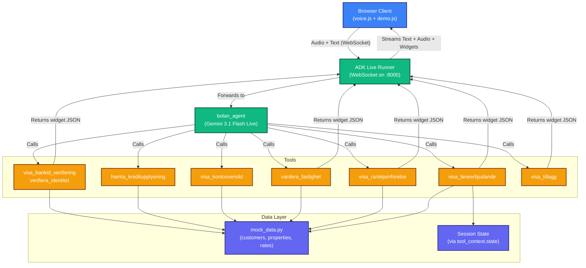

# Architecture

## System Overview



---

## Model Configuration

The agent uses a custom `AIStudioGemini` LLM class (extending `Gemini`) that forces the Gemini Developer API even if GCP env vars are set:

- **Model**: `gemini-3.1-flash-live-preview`
- **Voice**: `Zephyr` (configured via `speech_config` on the model instance)
- **Live API version**: `v1alpha`
- **API Key**: Set via `GOOGLE_API_KEY` environment variable (loaded from `.env`)
- **Text fallback**: Set `USE_TEXT_MODEL=true` to use `gemini-flash-latest` without voice

> **Important**: The `speech_config` must be set on the `Gemini` model instance, not on the Agent's `generate_content_config`. ADK only reads `speech_config` from the model for Live API sessions.

---

## Widget Pipeline (A2UI)

Tools return a dict with `widget_type` as the dispatch key. The pipeline has two stages:

### Backend (agent.py)
1. Tool returns `{'widget_type': '...', ...}` dict
2. `after_tool_callback` (`handle_a2ui_rendering`) stores payload in `state['pending_widgets']` and JSON-serializes the response
3. `after_agent_callback` (`flush_pending_widgets`) reads `pending_widgets`, creates `UiWidget` objects via `render_ui_widgets`, and sets `state_delta` as fallback

### Frontend (voice.js → demo.js)
The frontend checks 4 delivery paths in `onmessage`:
1. `data.actions.render_ui_widgets` — primary path
2. `data.actions.state_delta.widget_*` — fallback for state delta keys
3. `data.content.parts[].functionResponse` — content parts format
4. `data.tool_response.functionResponses` — ADK Live API format

| widget_type | Tool | Frontend Renderer | Timing |
|---|---|---|---|
| `bankid` | `visa_bankid_verifiering` | BankID login card | Immediate |
| `bankid_verified` | `verifiera_identitet` | Verified checkmark | Immediate |
| `financial_overview` | `visa_kontooversikt` | Account balances + investment chart | Immediate |
| `avm_valuation` | `vardera_fastighet` | 5-phase loading → result card | Immediate |
| `rate_comparison` | `visa_rantejamforelse` | Rate comparison chip grid | Deferred |
| `loan_offer` | `visa_laneerbjudande` | Personalized offer card | Deferred |
| `addons` | `visa_tillagg` | Add-on option cards | Deferred |

---

## Rate Calculation Engine

The offered rate is computed by `calculate_offered_rate()` in `mock_data.py`:

```
offered_rate = base_rate[binding_period]
             + risk_adjustment[uc_category]
             + ltv_adjustment[ltv_tier]
             + employment_adjustment[employment_type]

Floor: 2.50%
```

**Base rates**: 3mo: 3.89%, 1yr: 3.65%, 2yr: 3.45%, 3yr: 3.29%, 5yr: 3.15%

**Adjustments**:
- UC risk: Very Low −0.15%, Low 0%, Medium +0.25%, High +0.55%
- LTV: ≤50% −0.10%, ≤70% 0%, ≤85% +0.25%, ≤90% +0.35%
- Employment: Permanent −0.05%, Self-employed +0.15%, Student +0.40%

Amortization follows Swedish Finansinspektionen rules: 2% for LTV >70%, 1% for LTV 50–70%, 0% below 50%.

This is wired into `visa_laneerbjudande()` in `tools.py`, using session state for risk category, LTV, and employment type.

---

## AVM Pipeline (5-Phase)

The property valuation widget has a specialized rendering pipeline to handle the timing gap between model text/audio and widget arrival:

1. **Early detection** — text containing "valuation"/"värdering" triggers text suppression (audio plays through)
2. **Static announcement** — frontend renders "Thanks for the address. I will now run an automated valuation..."
3. **Loading animation** — 5-step progress animation (~7s) with Lantmäteriet/Booli branding
4. **Result card** — estimated market value rendered as ±5% confidence range
5. **Release** — suppression cleared, 15s cooldown prevents re-trigger, model prompted for post-AVM commentary

---

## Audio Synchronization

In the Gemini Live API, audio chunks arrive **200–800ms after** corresponding text tokens. The frontend manages three muting modes:

- **`drop`**: Audio chunks are discarded (used during static welcome flow)
- **`buffer`**: Audio is buffered and replayed after widget renders (used for financial overview)
- **unmuted**: Normal playback

Key timing rules:
- Pre-AVM: early detection suppresses text but NOT audio (model's acknowledgment is heard)
- During AVM: model has completed its turn, no unwanted audio follows
- Post-AVM: cooldown flag prevents "valuation" in commentary from re-triggering suppression

---

## Monkey Patches

Two monkey patches on `GeminiLlmConnection` (version-guarded for ADK 2.0.x):

### `receive`
Handles Gemini 3.1 Live Preview's tool call behavior. Under this model, `turn_complete` is NOT sent when the model issues a tool call — the receive loop must break early on `message.tool_call` to execute the tool immediately. Also handles transcription aggregation, grounding metadata, and session resumption.

### `send_history`
Converts multi-turn conversation history into a single-turn text transcript. The Live API's `send_client_content` doesn't support the full history format that non-live sessions use, so we serialize it as a labeled transcript and send as a single user content turn.

Also includes `strip_a2ui_payload()` which removes `a2ui_payload` keys from function responses before including them in the transcript (reduces token usage).

---

## Debug Mode

Append `?debug` to the URL to enable:
- Version banner in console
- Console monkey-patching that captures `[Live]`/`[Voice]`/`[GeminiVoice]` logs
- Press `Ctrl+Shift+L` to copy debug logs to clipboard
